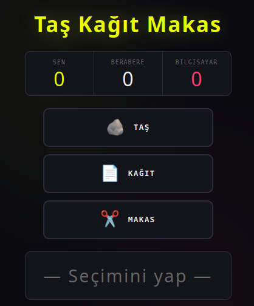

# TR
# Taş Kağıt Makas Oyunu
Karanlık temalı, animasyonlu, kullanıcı karşısında bilgisayarın rastgele seçim yaptığı taş-kağıt-makas oyunu. Skorlar localStorage'a kaydedilir; sayfa yenilendiğinde puan tablosu korunur.

## Canlı Önizleme

[Proje önizleme.](https://dursunkokturk.github.io/JavaScript-Project-Game-Rock-Paper-Scissor/)

## Özellikler

- Bilgisayara Karşı Oyna — Bilgisayar her turda Math.random() ile rastgele seçim yapar
- Anlık Sonuç Alanı — Kazandın / Kaybettin / Berabere durumu; seçilen emojiler ve açıklama metniyle birlikte gösterilir
- Pop Animasyonu — Her hamle sonrası sonuç kutusu scale ile animasyona girer
- Puan Tablosu — Sen, Bilgisayar ve Beraberlik skorları üst kısımda anlık güncellenir
- localStorage Kalıcılığı — Üç skor ayrı anahtarlarla kaydedilir; sayfa yenilendiğinde kaybolmaz
- Oyunu Sıfırla — Tüm skorlar sıfırlanır, localStorage güncellenir ve sonuç alanı temizlenir
- Duyarlı Buton Düzeni — Mobilsde butonlar alt alta, tablette ve masaüstünde yan yana dizilir
- CSS Değişkenleri ile Tema — Tüm renkler :root üzerinden yönetilir; kolay özelleştirme

## Oyun Kuralları

| Kullanıcı      | Bilgisayar  | Sonuç      |
| -------------- |-------------| -----------|
| Taş            | Makas       | Kazandın   |
| Kağıt          | Taş         | Kazandın   |
| Makas          | Kağıt       | Kazandın   |
| Herhangi       | Aynısı      | Beraberlik |
| Diğer durumlar | —           | Kaybettin  |

## Duyarlı Düzenler

| Ekran    | Genişlik         | Buton Düzeni                              |
| -------- |------------------| ------------------------------------------|
| Mobil    | 375px Varsayılan | Alt alta, yatay (ikon + metin yan yana)   |
| Tablet   | ≥ 767px          | Yan yana, dikey (ikon üstte, metin altta) |
| Masaüstü | ≥ 1024px         | Yan yana, daha büyük boyutlar             |

## Teknolojiler
 
| Teknoloji  | Açıklama                                                                        |
| ---------- |---------------------------------------------------------------------------------|
| HTML5      | Semantik sayfa yapısı                                                           |
| CSS3       | CSS değişkenleri, Flexbox, @keyframes, @media sorguları                         |
| JavaScript | Oyun mantığı, DOM manipülasyonu, localStorageGoogle FontsSpace Mono, Bebas Neue |

## Proje Yapısı
rock-paper-scissor/  
├── index.html  
└── assets/  
    ├── css/  
    │   └── style.css  
    └── js/  
        └── rock-paper-scissor.js  

## Kurulum
Proje herhangi bir bağımlılık gerektirmez.
bash# Repoyu klonlayın
git clone https://github.com/kullanici-adi/rock-paper-scissor.git

### Proje klasörüne girin
cd rock-paper-scissor

### index.html dosyasını tarayıcıda açın
open index.html

#### Not: 
rock-paper-scissor.js dosyası defer ile yüklenir; DOM hazır olmadan önce çalışmaz.

## Tasarım Detayları

- Tema: Tam karanlık (dark-only)
- Renk Paleti (CSS değişkenleri):

    - --bg: #0a0a0f — Sayfa arka planı
    - --surface: #13131a — Kart ve buton yüzeyi
    - --accent: #e8ff00 — Neon sarı (kullanıcı skoru, kazanma durumu, hover)
    - --accent2: #ff3c6e — Neon pembe (bilgisayar skoru, kaybetme durumu)
    - --muted: #666 — İkincil metin ve beraberlik durumu

- Fontlar: Bebas Neue (başlık ve skorlar) · Space Mono (buton ve detay metni)
- Arka Plan Efekti: İki renkte radial gradient ile hafif ışıma
- Animasyon: pop keyframe ile scale(1.08) zıplama efekti (0.25s)

# EN
# Rock Paper Scissors Game
A dark-themed, animated rock-paper-scissors game where the computer makes random choices against the user. Scores are saved to localStorage and the scoreboard persists across page refreshes.

## Live Preview
Project Preview

## Features

- Play Against the Computer — The computer makes a random choice each round using Math.random()
- Instant Result Display — Win / Lose / Draw outcome shown with selected emojis and descriptive text
- Pop Animation — After each move, the result box enters with a scale animation
- Scoreboard — Your, Computer, and Draw scores update in real time at the top
- localStorage Persistence — Three scores saved with separate keys; survive page refreshes
- Reset Game — All scores reset to zero, localStorage updated, and result area cleared
- Responsive Button Layout — Buttons stack vertically on mobile, side by side on tablet and desktop
- CSS Variable Theming — All colors managed via :root; easy to customize

## Game Rules
 
| User        | Computer  | Result   |
| ----------- |-----------| ---------|
| Rock        | Scissors  | You Win  |
| Paper       | Rock      | You Win  |
| Scissors    | Paper     | You Win  |
| Any         | Same      | Draw     |
| Other cases | —         | You Lose |

## Responsive Layouts

| Screen  | Width         | Button Layout                                             |
| ------- |---------------| ----------------------------------------------------------|
| Mobil   | 375px Default | Stacked vertically, horizontal (icon + text side by side) |
| Tablet  | ≥ 767px       | Side by side, vertical (icon on top, text below)          |
| Desktop | ≥ 1024px      | Side by side, larger sizes                                |

## Technologies

| Technology   | Description                                        |
| ------------ |----------------------------------------------------|
| HTML5        | Semantic page structure                            |
| CSS3         | CSS variables, Flexbox, @keyframes, @media queries |
| JavaScript   | Game logic, DOM manipulation, localStorage         |
| Google Fonts | Space Mono, Bebas Neue                             |

## Project Structure
rock-paper-scissor/  
├── index.html  
└── assets/  
    ├── css/  
    │   └── style.css  
    └── js/  
        └── rock-paper-scissor.js  

## Installation
The project requires no dependencies.
bash# Clone the repo
git clone https://github.com/username/rock-paper-scissor.git

### Navigate to the project folder
cd rock-paper-scissor

### Open index.html in the browser
open index.html

#### Note: 
rock-paper-scissor.js is loaded with defer and will not run before the DOM is ready.

## Design Details
- Theme: Dark only
- Color Palette (CSS variables):

   - --bg: #0a0a0f — Page background
   - --surface: #13131a — Card and button surface
   - --accent: #e8ff00 — Neon yellow (user score, win state, hover)
   - --accent2: #ff3c6e — Neon pink (computer score, lose state)
   - --muted: #666 — Secondary text and draw state

- Fonts: Bebas Neue (headings and scores) · Space Mono (button and detail text)
- Background Effect: Subtle glow with two-color radial gradient
- Animation: pop keyframe with scale(1.08) bounce effect (0.25s)
